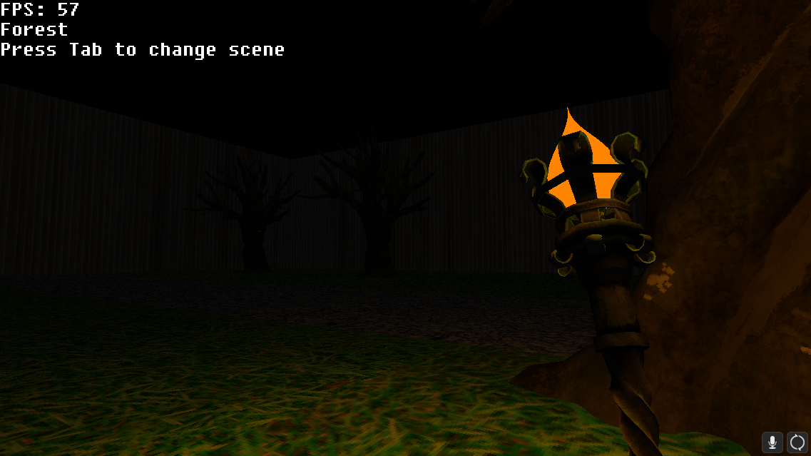
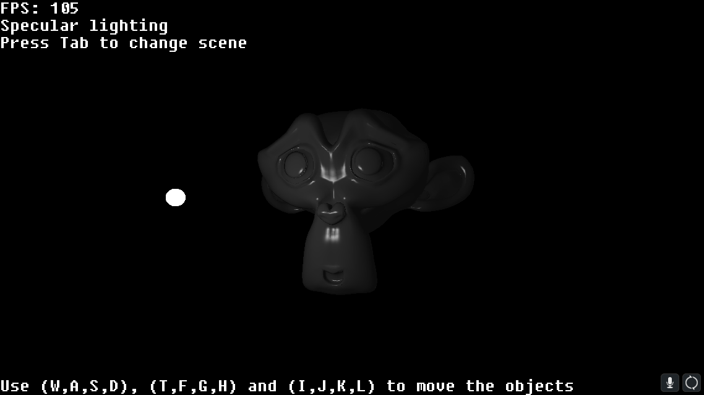
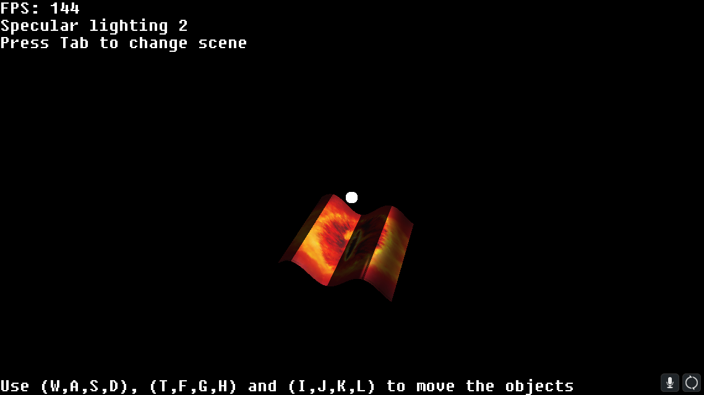

# 3D Engine

# General Info

3D Engine written in C++
Is capable of loading in .obj models and displaying them in a 3D environment, complete with texturing, shadows, camera and depth.
Light and objects have adjustable colors and act on each other accordingly.
Has an adjustable pipeline with programmable shaders, to make different effects and looks easy to implement.
.obj files can be loaded in with their textures and normals. If no normals are present, approximation of them can be calculated.

The version in this GitHub Repo comes with 3 different scenes, which show off some of the capabilites of the engine.

The engine uses the Chili Framework from http://www.planetchili.net. The engine is based off the tutorial series <a href="[https://github.com/Murad9288](https://youtu.be/uehGqieEbus?si=woLOXUblHZqOfrUq)" target="_blank"> 3D Fundamentals from ChiliTomatoNoodle on YouTube </a>, so there will be a lot of similarities. The tutorial was only a place to learn and little to none of the code was copied, so the code was still written by me.

The executable for the engine is available under the Download folder. Make sure to download the entire folder if you want to run it.

**Note**: This engine does not run on the GPU and also runs on only one thread. Additionally, performance was not the priority when writing it. This means the performance is not that great, but still usable. This project was merely to get familiar with and learn the logic of 3D Engines and have a first version of one.

## Images

